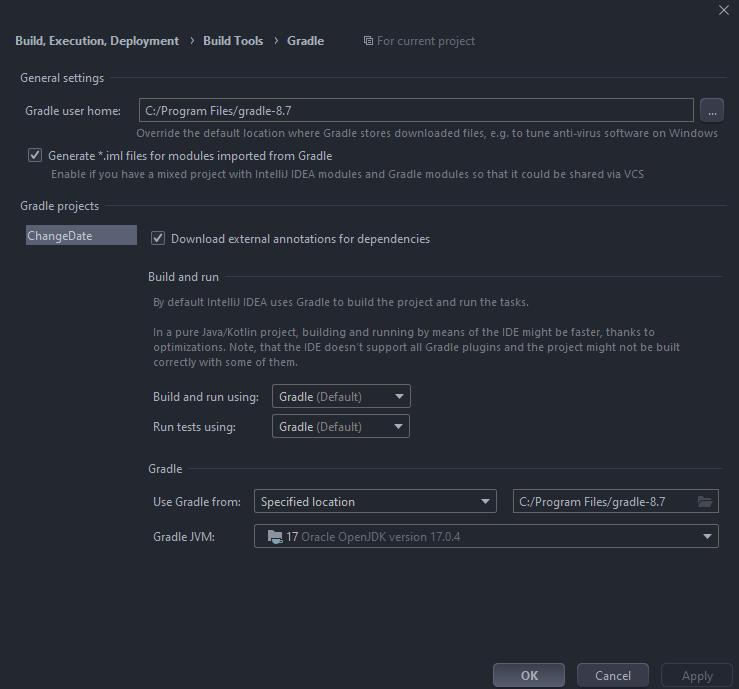

# **README**
Modify date changer.

## **Features**
Sets ModifiedOnUTC of Descriptor.json file when run command in Rider.

### **Release Notes**
Descriptor.json file changing implemented.

0.1 Initial project release.

#### **How to use**
1. Clone this repository
2. Install gradle in your computer globally and add gradle in environment variables
3. Configure project setting like this 
4. Run command in terminal gradle build
5. After build go to Rider Settings > Plugins > Install Plugin from Disk…
6. To run plugin use hot keys ctrl+alt+\